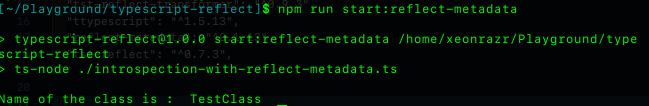
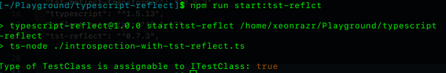

### Introspecting classes in typescript
----------------------------------------

>In conventional languages like Java, C# there is option to introspect the code during runtime for eg. Java class exposes method like getClass which can identify the parent class. However, in javascript it is not possible. Recently, the Reflect buli-in object has been enabled for javascript to inspect shape and properties of an object. Even then Typescript which is a superset of javascript does not support this feature by default. The examples in the the project are more of an ongoing proposal and experimental feature to add introspection capabilities by default. This is to demonstrate that Typescript can handle introspection of classes and objects.


**tsconfig.json**
```
 "emitDecoratorMetadata": true,
 "experimentalDecorators": true,
```

**important packages**
```
  "tst-reflect-transformer": "^0.9.3",
  "ttypescript": "^1.5.13",
  "reflect-metadata": "^0.1.13",
  "tst-reflect": "^0.7.3",
```


#### Code for [reflect-metadata](https://www.npmjs.com/package/reflect-metadata) #### 

```
import "reflect-metadata";

class TestClass {
  name: string = "Test";
  age: number = 23;
}

Reflect.defineMetadata("getClass", "TestClass", TestClass.prototype, "");

const className = new TestClass();

let metadataValue = Reflect.getMetadata("getClass", className, "");

console.log("Name of the class is : ", metadataValue);


```




#### Code for [tst-reflect](https://www.npmjs.com/package/tst-reflect) #### 

```
import { getType, Type } from "tst-reflect";

interface ITestClass {
  name: string;
  age: number;
}

class TestClass {
  name: string = "Test";
  age: number = 23;
}

const obj = new TestClass();

const typeOfITestClass: Type = getType<ITestClass>();
const typeOfTestClass: Type = getType<TestClass>();

console.log(
  "Type of TestClass is assignable to ITestClass:",
  typeOfTestClass.isAssignableTo(typeOfITestClass)
);

```


